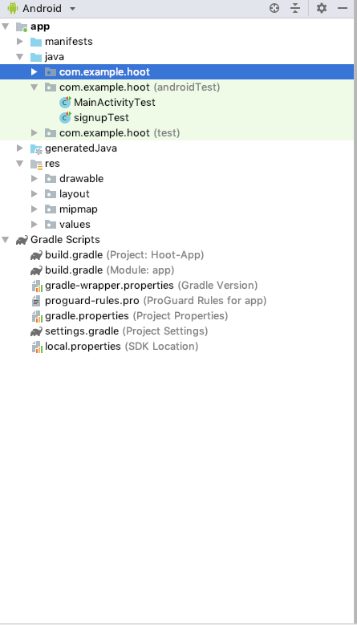
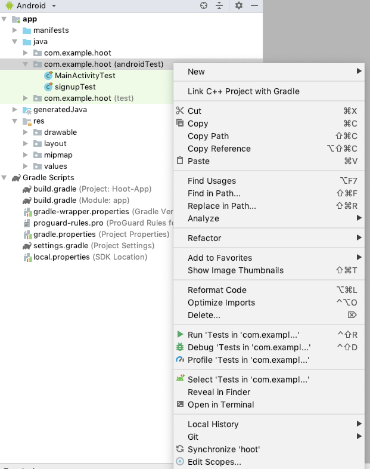

# Hoot
Providing an intermediary for young and old to share time and experiences together. This was developed as a group project in weeks 11 and 12 at Makers Academy by six members of the January 2019 cohort.

# User Stories

```
As a new user
so I can use a new service
I want to be able to sign-up
```

```
As a returning user
so i can use the service again
I want to be able to login
```

```
As a new user
so I can define what kind of user I am
I want to choose 'wise' or 'free' when creating a profile
```

```
As a new user
so I can show other users my interests
I want to write some information about myself
```

```
As a user
so I can see who I want to connect with
I want to see a feed of opposite users
```

# Technologies

- Java - Android Studios IDE
- Firebase for database, authentication, storage and messaging
- XML in android for front end

#### Testing
- Junit for unit tests
- Espresso for feature tests

#### Other
- GitMoji :art:

# Project aims
- Quality, easily-changeable code
- High test coverage (95%+)
- Effective Agile working methods with 2-day sprints
- Strict best-practice Git use (branching, pull request reviewing)

# Project docs
- Documentation of goals, process and learnings can be found in our project [wiki](https://github.com/wise-social2/Hoot-App/wiki).
- [Kanban board](https://github.com/orgs/wise-social2/projects/1)

# Installing and running the app

To install a development instance locally, clone this repository and then download [Android Studio](https://developer.android.com/studio/install).

Then follow the instructions on [this wiki page](https://github.com/wise-social2/Hoot-App/wiki/Using-a-virtual-device-to-run-the-app).

### Running the tests

To run the tests, right click on 'Run Tests' as shown below.




